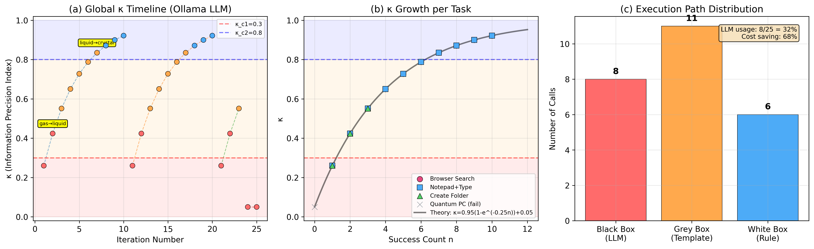

# κ-Desktop: Information Phase Transition Theory for Desktop Automation

> **A novel theoretical framework that models desktop automation as an information phase transition system, inspired by thermodynamic phase transitions (Gas → Liquid → Crystal).**

  

---

## 📖 Overview

κ-Desktop introduces the **Information Precision Index** κ ∈ [0, 1] to quantify how well a system "understands" a user's desktop instruction. As the system gains experience with repeated tasks, κ grows following an exponential saturation law:

$$\kappa(n) = \kappa_{\max}(1 - e^{-\lambda n}) + \kappa_{\min}$$

This growth drives **phase transitions** between three execution backends:

| Phase | κ Range | Backend | Description |
|:------|:--------|:--------|:------------|
| 🔴 **Gas** | κ < 0.3 | Black Box (LLM) | Unknown tasks → call LLM for interpretation |
| 🟡 **Liquid** | 0.3 ≤ κ < 0.8 | Grey Box (Template) | Familiar tasks → use learned templates |
| 🔵 **Crystal** | κ ≥ 0.8 | White Box (Rule) | Mastered tasks → execute deterministic rules |

### The Three-Box Architecture
